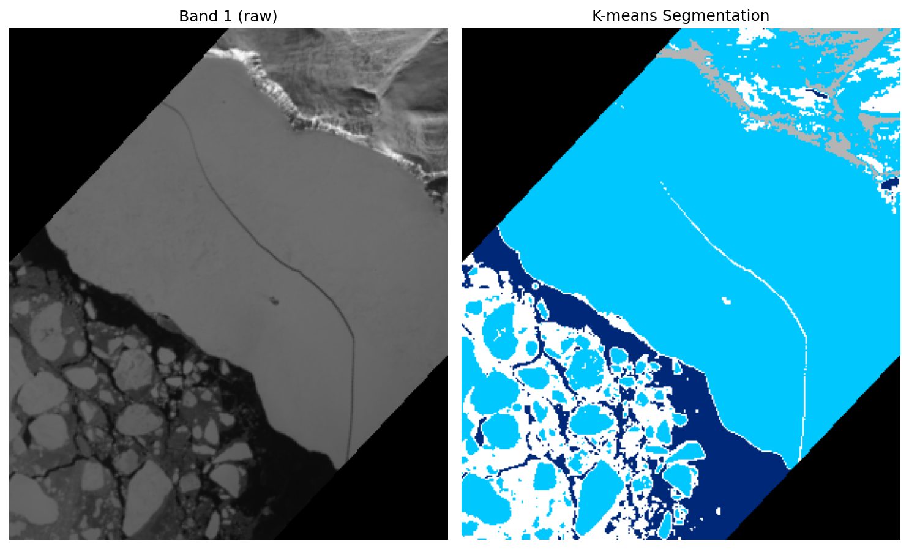
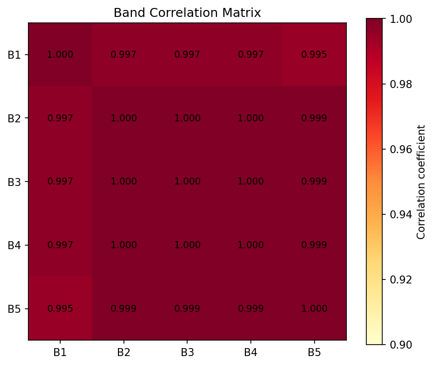
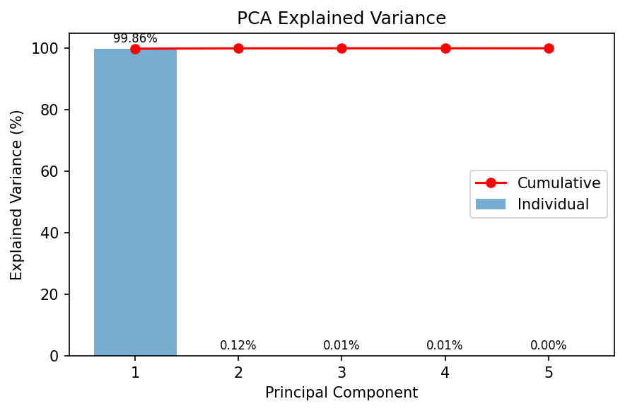
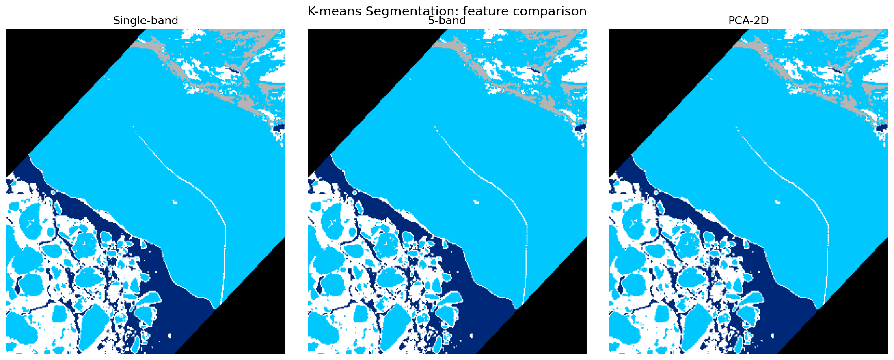
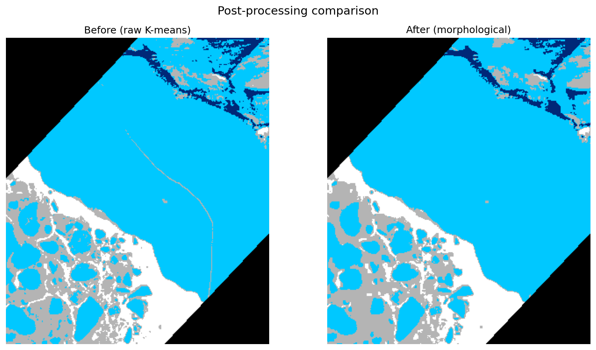

# Hyperspectral Sea-Ice Segmentation

> 基于 K-means 聚类与 PCA 降维的高光谱海冰影像无监督分割
> Unsupervised segmentation of hyperspectral sea-ice imagery via PCA + K-means

格陵兰岛巴芬湾（Baffin Bay）海域高光谱影像的逐像素分割。在**无标注**条件下，将影像分为**海水、薄冰、厚冰、陆地**四类，并标注无效区域（“其他”）。


---

## 📖 项目背景

输入数据为一景格陵兰岛巴芬湾海域的高光谱影像，空间尺寸 **350 × 300**，从原始高光谱波段中筛选出 **5 个波段**（每个波段为一张 350×300 灰度图）。任务是综合 5 个波段的光谱信息，对影像进行逐像素分割，区分以下地物：

| 类别 | 说明 | 标注色 |
|------|------|--------|
| 海水 | Sea water | 深蓝 |
| 薄冰 | Thin ice | — |
| 厚冰 | Thick ice | 青 / 白 |
| 陆地 | Land | 灰 |
| 其他 | 像素值为 0 的无效区域 | 黑 |

由于数据**未提供真值标签**，本项目采用**无监督聚类**完成分割。

---

## 🔬 方法概述

整体流程：**5 波段堆叠 → 相关性分析 → PCA 降维 → K-means 聚类 → 形态学后处理 → 无监督评估**

```
5 个波段 PNG
   │
   ▼
堆叠为 350×300×5 高光谱立方体  →  逐像素展开为 (105000, 5) 特征矩阵
   │
   ▼
波段相关性分析 ── 发现严重冗余 (相关系数 ≈ 0.998)
   │
   ▼
PCA 降维 ── PC1 解释 99.86% 方差，5 维 → 2 维
   │
   ▼
K-means 聚类 (K=4) ── 海水 / 薄冰 / 厚冰 / 陆地
   │
   ▼
形态学开/闭运算 ── 去椒盐噪声、平滑边界
   │
   ▼
无监督评估 (轮廓系数等) + 彩色分割图输出
```

### 核心发现：高光谱波段冗余

经相关性分析，5 个波段两两相关系数均 **> 0.99**（平均 0.998），存在严重信息冗余——这是高光谱数据的典型特性。PCA 进一步证实：**第一主成分单独解释了 99.86% 的方差**，故仅用前 2 个主成分即可无损完成分割。

---

## 📂 项目结构

```
hyperspectral-sea-ice-segmentation/
├── data/                       # 5 个波段输入图
│   ├── 1-1.png ... 1-5.png
├── src/                        # 源代码（5 个模块）
│   ├── main.py                 # ① 基线：K-means 分割
│   ├── band_correlation.py     # ② 波段相关性分析
│   ├── pca_segmentation.py     # ③ PCA 降维 + 分割
│   ├── comparison.py           # ④ 对比实验（单波段/5波段/PCA）
│   └── evaluate_postprocess.py # ⑤ 无监督评估 + 形态学后处理
├── figures/                    # 运行生成的结果图
├── requirements.txt
└── README.md
```

---

## 🚀 快速开始

### 环境依赖

```bash
pip install -r requirements.txt
```

依赖：`numpy`、`pillow`、`scikit-learn`、`scipy`、`matplotlib`

### 运行

所有脚本默认从当前目录读取 `1-1.png ~ 1-5.png`。请在 `data/` 目录下运行，或将脚本与数据放在同一目录：

```bash
cd data
python ../src/main.py                  # ① 基线分割 → segmentation_result.png
python ../src/band_correlation.py      # ② 相关性分析 → correlation_heatmap.png
python ../src/pca_segmentation.py      # ③ PCA → pca_variance.png, seg_pca.png
python ../src/comparison.py            # ④ 对比实验 → comparison_3methods.png
python ../src/evaluate_postprocess.py  # ⑤ 评估+后处理 → final_segmentation.png
```

---

## 📊 各模块说明与结果

### ① 基线：K-means 分割 (`main.py`)

将 5 个波段堆叠为高光谱立方体，每个像素视为一个 5 维光谱向量，对全部有效像素（剔除值全为 0 的黑边）做 K=4 的 K-means 聚类。



### ② 波段相关性分析 (`band_correlation.py`)

计算 5 个波段的相关系数矩阵。结果显示所有非对角相关系数落在 **0.995~1.000**，平均 0.998，散点图中像素几乎完全分布于 y=x 直线上 —— 证明波段间存在严重冗余。



### ③ PCA 降维 + 分割 (`pca_segmentation.py`)

针对波段冗余引入 PCA。**第一主成分解释 99.86% 方差**，前两个主成分累计 99.98%。仅用 2 维主成分即可无损完成分割。



### ④ 对比实验 (`comparison.py`)

对比单波段、全 5 波段、PCA 三种方案，以全波段为基准计算分割一致率：

| 方案 | 与全波段一致率 | 说明 |
|------|:---:|------|
| 单波段 (Single-band) | 99.10% | 大体可分，差异集中在碎冰边界 |
| 全 5 波段 (5-band) | 100% (基准) | — |
| PCA 降维 (PCA-2D) | 100% | 无损，维度更低、抗噪更好 |



### ⑤ 无监督评估 + 后处理 (`evaluate_postprocess.py`)

**无监督评估**（无需真值标签）：

| 指标 | 数值 | 理想方向 |
|------|:---:|:---:|
| 轮廓系数 Silhouette | 0.736 | 越接近 1 越好 |
| Calinski-Harabasz | 313151 | 越大越好 |
| Davies-Bouldin | 0.477 | 越小越好 |

**形态学后处理**：对各类别施加开运算（去孤立噪点）+ 闭运算（填小洞），连通碎片由 **759 → 528**，清除约 **30.4%** 的椒盐噪声。



---

## 💡 关于数据维度的说明

本项目数据仅约 200 KB（5 张 350×300 灰度图），但这符合高光谱数据特性：其价值在于**光谱维度的信息密度**而非空间分辨率或样本数量。从机器学习视角看，影像等价于 **350×300 = 105,000 个 5 维光谱样本**，样本量充足。无监督逐像素分类正是高光谱在缺乏标注时的标准处理范式。

---

## 🛠️ 技术栈

- **聚类**：scikit-learn `KMeans`
- **降维**：scikit-learn `PCA`
- **评估**：Silhouette / Calinski-Harabasz / Davies-Bouldin
- **后处理**：scipy `ndimage` 形态学开/闭运算
- **可视化**：matplotlib

---

## 📌 可能的改进方向

- 引入**马尔可夫随机场 (MRF)** 或超像素分割，更系统地利用空间邻域信息
- 对比 **GMM（高斯混合）**、**谱聚类** 等其他无监督方法
- 若可获取少量标注，引入半监督方法并计算 OA / Kappa 等监督指标

---

## 📄 License

MIT
