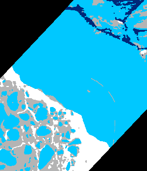
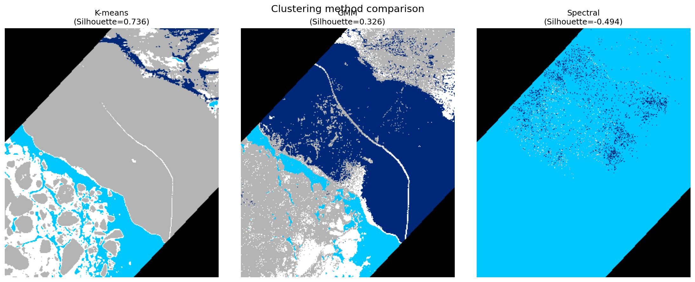
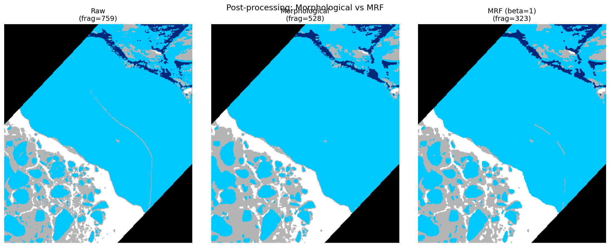
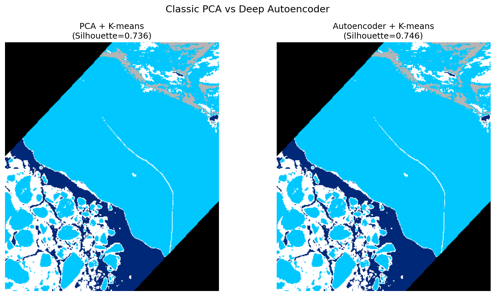

# Hyperspectral Sea-Ice Segmentation

> 基于 K-means 聚类与 PCA 降维的高光谱海冰影像无监督分割
> Unsupervised segmentation of hyperspectral sea-ice imagery via PCA + K-means

格陵兰岛巴芬湾（Baffin Bay）海域高光谱影像的逐像素分割。在**无标注**条件下，将影像分为**海水、薄冰、厚冰、陆地**四类，并标注无效区域（“其他”）。完整流程涵盖波段相关性分析、PCA 降维、多种聚类方法对比、形态学与马尔可夫随机场（MRF）两种后处理，并通过**深度自编码器**与经典 PCA 做特征学习对比。



---

## 📖 项目背景

输入数据为一景格陵兰岛巴芬湾海域的高光谱影像，空间尺寸 **350 × 300**，从原始高光谱波段中筛选出 **5 个波段**（每个波段为一张 350×300 灰度图）。任务是综合 5 个波段的光谱信息，对影像进行逐像素分割，区分以下地物：

| 类别 | 说明                  | 标注色  |
| ---- | --------------------- | ------- |
| 海水 | Sea water             | 深蓝    |
| 薄冰 | Thin ice              | —       |
| 厚冰 | Thick ice             | 青 / 白 |
| 陆地 | Land                  | 灰      |
| 其他 | 像素值为 0 的无效区域 | 黑      |

由于数据**未提供真值标签**，本项目采用**无监督聚类**完成分割。

---

## 🔬 方法概述

整体流程：**5 波段堆叠 → 相关性分析 → PCA 降维 → 聚类方法对比 → MRF/形态学后处理 → 无监督评估**

```
5 个波段 PNG
   │
   ▼
堆叠为 350×300×5 高光谱立方体  →  逐像素展开为 (105000, 5) 特征矩阵
   │
   ▼
波段相关性分析 ── 发现严重冗余 (相关系数 ≈ 0.998)
   │
   ▼
PCA 降维 ── PC1 解释 99.86% 方差，5 维 → 2 维
   │
   ▼
聚类方法对比 ── K-means / GMM / 谱聚类，K-means 最优
   │
   ▼
后处理 ── 形态学(碎片 -30%) 与 MRF(碎片 -57%) 对比
   │
   ▼
经典 vs 深度学习 ── PCA 与深度自编码器特征学习对比
   │
   ▼
无监督评估 (轮廓系数等) + 彩色分割图输出
```

### 核心发现：高光谱波段冗余

经相关性分析，5 个波段两两相关系数均 **> 0.99**（平均 0.998），存在严重信息冗余——这是高光谱数据的典型特性。PCA 进一步证实：**第一主成分单独解释了 99.86% 的方差**，故仅用前 2 个主成分即可无损完成分割。

---

## 📂 项目结构

```
hyperspectral-sea-ice-segmentation/
├── data/                       # 5 个波段输入图
│   ├── 1-1.png ... 1-5.png
├── src/                        # 源代码（8 个模块）
│   ├── main.py                 # ① 基线：K-means 分割
│   ├── band_correlation.py     # ② 波段相关性分析
│   ├── pca_segmentation.py     # ③ PCA 降维 + 分割
│   ├── comparison.py           # ④ 特征对比（单波段/5波段/PCA）
│   ├── evaluate_postprocess.py # ⑤ 无监督评估 + 形态学后处理
│   ├── cluster_comparison.py   # ⑥ 聚类方法对比（K-means/GMM/谱聚类）
│   ├── mrf_smoothing.py        # ⑦ 马尔可夫随机场(MRF)平滑
│   └── autoencoder_clustering.py # ⑧ 深度自编码器 vs PCA 特征学习
├── figures/                    # 运行生成的结果图
├── requirements.txt
└── README.md
```

---

## 🚀 快速开始

### 环境依赖

```bash
pip install -r requirements.txt
```

依赖：`numpy`、`pillow`、`scikit-learn`、`scipy`、`matplotlib`；模块 ⑧ 额外需要 `torch`

### 运行

所有脚本默认从当前目录读取 `1-1.png ~ 1-5.png`。请在 `data/` 目录下运行，或将脚本与数据放在同一目录：

```bash
cd data
python ../src/main.py                  # ① 基线分割
python ../src/band_correlation.py      # ② 相关性分析
python ../src/pca_segmentation.py      # ③ PCA 降维
python ../src/comparison.py            # ④ 特征对比
python ../src/evaluate_postprocess.py  # ⑤ 评估 + 形态学
python ../src/cluster_comparison.py    # ⑥ 聚类方法对比
python ../src/mrf_smoothing.py         # ⑦ MRF 平滑
python ../src/autoencoder_clustering.py # ⑧ 自编码器 vs PCA (需 torch)
```

---

## 📊 各模块说明与结果

### ① 基线：K-means 分割 (`main.py`)

将 5 个波段堆叠为高光谱立方体，每个像素视为一个 5 维光谱向量，对全部有效像素（剔除值全为 0 的黑边）做 K=4 的 K-means 聚类。


### ② 波段相关性分析 (`band_correlation.py`)

计算 5 个波段的相关系数矩阵。结果显示所有非对角相关系数落在 **0.995~1.000**，平均 0.998，散点图中像素几乎完全分布于 y=x 直线上 —— 证明波段间存在严重冗余。


### ③ PCA 降维 + 分割 (`pca_segmentation.py`)

针对波段冗余引入 PCA。**第一主成分解释 99.86% 方差**，前两个主成分累计 99.98%。仅用 2 维主成分即可无损完成分割。


### ④ 特征方案对比 (`comparison.py`)

对比单波段、全 5 波段、PCA 三种特征方案，以全波段为基准计算分割一致率：

| 方案                 | 与全波段一致率 | 说明                         |
| -------------------- | :------------: | ---------------------------- |
| 单波段 (Single-band) |     99.10%     | 大体可分，差异集中在碎冰边界 |
| 全 5 波段 (5-band)   |  100% (基准)   | —                            |
| PCA 降维 (PCA-2D)    |      100%      | 无损，维度更低、抗噪更好     |


### ⑤ 无监督评估 + 形态学后处理 (`evaluate_postprocess.py`)

**无监督评估**（无需真值标签）：

| 指标                |  数值  |   理想方向    |
| ------------------- | :----: | :-----------: |
| 轮廓系数 Silhouette | 0.736  | 越接近 1 越好 |
| Calinski-Harabasz   | 313151 |   越大越好    |
| Davies-Bouldin      | 0.477  |   越小越好    |

**形态学后处理**：对各类别施加开运算（去孤立噪点）+ 闭运算（填小洞），连通碎片由 **759 → 528**，清除约 **30.4%** 的椒盐噪声。


### ⑥ 聚类方法对比 (`cluster_comparison.py`)

在 PCA 特征上对比三种无监督聚类方法。谱聚类因相似度矩阵内存开销大，采用**子采样训练 + KNN 外推**策略。

| 方法              | 轮廓系数↑ |  CH 指数↑  | DB 指数↓  |
| ----------------- | :-------: | :--------: | :-------: |
| **K-means**       | **0.736** | **313151** | **0.477** |
| GMM               |   0.326   |   34259    |   10.43   |
| 谱聚类 (Spectral) |  -0.433   |    885     |   1.94    |

K-means 表现最佳：PCA 降维后各地物在主成分空间近似呈球状团簇，恰好契合 K-means 的球形簇假设。



### ⑦ 马尔可夫随机场 (MRF) 平滑 (`mrf_smoothing.py`)

将分割建模为能量最小化问题——数据项（光谱拟合）+ β·平滑项（邻域一致性，Potts 模型），用 ICM（迭代条件模式）求解。

| 方法          | 碎片数  |  相对 raw  |
| ------------- | :-----: | :--------: |
| Raw K-means   |   759   |     —      |
| 形态学        |   528   |   −30.4%   |
| **MRF (β=1)** | **323** | **−57.4%** |

MRF 去噪效果显著优于形态学，且因同时约束光谱与空间一致性，更好地保留了碎冰区的真实边界。在 β∈[0.2, 3.0] 范围内结果稳定，表明数据光谱可分性强、算法对平滑强度鲁棒。



### ⑧ 深度自编码器 vs PCA (`autoencoder_clustering.py`)

引入深度自编码器（5→8→2→8→5 对称结构）学习 2 维**非线性**隐特征，与经典 PCA 的**线性**降维对比，二者均在隐空间上施加 K-means。

| 方案                  |  重建 MSE↓  | 轮廓系数↑ |
| --------------------- | :---------: | :-------: |
| **PCA + K-means**     | **0.00016** | **0.736** |
| Autoencoder + K-means |   0.0031    |   0.665   |

结果显示经典 PCA 略优于自编码器。这与前文分析一致：该数据波段相关系数 0.998、首主成分解释 99.86% 方差，**本质呈强线性结构**，线性 PCA 已逼近最优，自编码器的非线性能力未带来增益。**该实验表明方法选择应以数据特性为依据，深度模型并非总是必要**——在数据结构简单时，经典线性方法兼具效率与精度优势。



---

## 💡 关于数据维度的说明

本项目数据仅约 200 KB（5 张 350×300 灰度图），但这符合高光谱数据特性：其价值在于**光谱维度的信息密度**而非空间分辨率或样本数量。从机器学习视角看，影像等价于 **350×300 = 105,000 个 5 维光谱样本**，样本量充足。无监督逐像素分类正是高光谱在缺乏标注时的标准处理范式。

---

## 🛠️ 技术栈

- **降维**：scikit-learn `PCA`；PyTorch 深度自编码器（非线性）
- **聚类**：scikit-learn `KMeans` / `GaussianMixture` / `SpectralClustering`
- **评估**：Silhouette / Calinski-Harabasz / Davies-Bouldin
- **后处理**：scipy `ndimage` 形态学开/闭运算；自实现 MRF-ICM
- **可视化**：matplotlib

---

## 📌 可能的改进方向

- 引入**超像素分割**进一步利用空间邻域信息
- 若可获取少量标注，引入半监督方法并计算 OA / Kappa 等监督指标
- 对 MRF 采用图割（Graph Cut）等全局优化求解器替代 ICM 局部优化

---

## 📄 License

MIT
